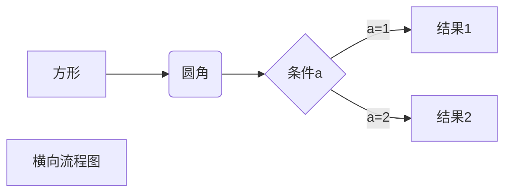
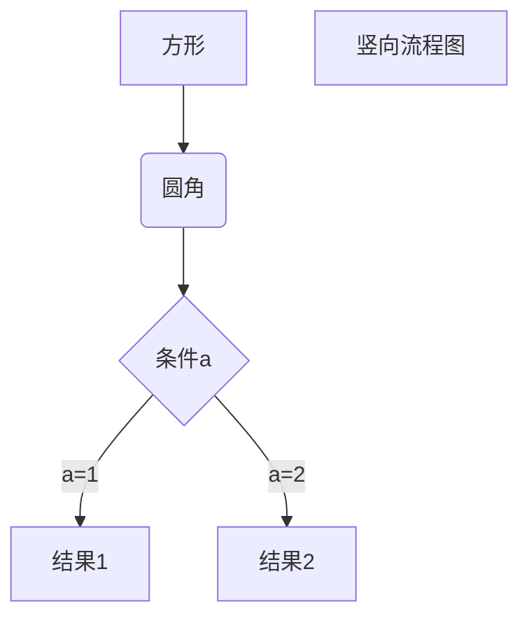
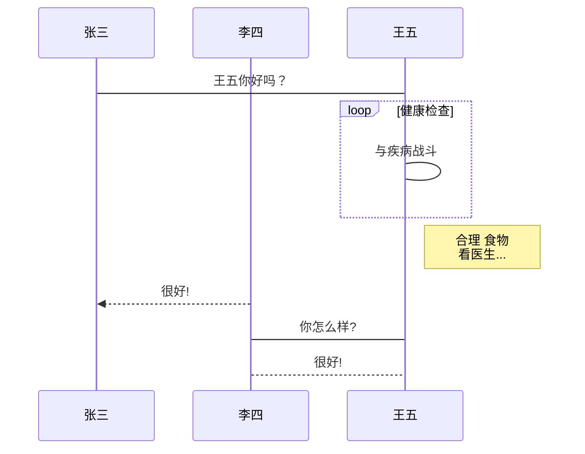

# 一级标题

## 二级标题

### 三级标题
*斜体文本*
_斜体文本_
**粗体文本**
__粗体文本__
***粗斜体文本***
___粗斜体文本___

**分割线**
---
***

~~这行文字已被删除~~
<u>这行文字已被添加下划线</u>

脚注[^1]
[^1]:这里是脚注

Markdown支持有序列表和无序列表。
无序列表使用星号(*)、加号(+)或是减号(-)作为列表标记
有序列表使用数字并加上.号标记
（列表标记与文字之间有空格）
* 第一
+ 第二
- 第三
1. 第四
2. 第五
3. 第六

列表嵌套需在子列表中的选项中添加四个空格
1. 第一
   - 第一个列表嵌套
2. 第二
   - 第二个列表嵌套

引用：引用须在段落开头使用 > 号，后面紧跟一个空格符号
> 这是一个引用
> 作者：刘小昔

引用中使用列表
> 引用列表
> * 这是一个引用
> - 作者：刘小昔
> 1. 单位：神伐阁 

列表中使用引用
如要在列表中使用引用，需要在>号前添加四个空格的缩进。
- 列表中使用引用 1
    > 这是一个引用
    > 作者：刘小昔
- 列表中使用引用 2

代码
markdown对代码块的语法是开始和结束行都要添加：\```，
其中 ` 为windows键盘左上角那个，要精确指定语言（如：java、python、php、go等等）时，
在头部直接指定，如：\```java
```python
import numpy as np 
import matplotlib.pyplot as plt 

x = np.arange(10)
y = 2 * x + 1
plt.plot( x, y, 'o' )
plt.show()
```

链接
链接语法格式：
[哔哩哔哩](https://www.bilibili.com/)

图片
图片语法格式：


在 Markdown 编辑器是无法调整图片的高度与宽度的，如需要可使用普通的\标签。


表格
制作表格使用 | 来分隔不同的单元格，使用 - 来分隔表头和其他行。
表格语法格式：
|  表头1   | 表头2  |  表头3  |
|  ----  | ----  | ----- |
| 单元格1  | 单元格2 | 单元格3 |
| 单元格4  | 单元格5 | 单元格6 |

如果你想调整表格的左对齐、右对齐、居中对齐，可按下述方式进行调整；
:- ：将表头及单元格的内容左对齐；
-: ：将表头及单元格的内容右对齐；
:-:：将表头及单元格的内容居中对齐；
|  表头1   | 表头2  |  表头3  |  表头4  |
|  :----  | :----: | :----: | ----:|
| 单元格1  | 单元格2 | 单元格3 |  单元格4 |
| 单元格1  | 单元格2 | 单元格3 |  单元格4 |

转义
在 Markdown 编辑器里面使用了很多特殊符号来表示特定的意义，该特殊符号将不再显示。
那么如果需要想让这些特殊符号显示出来，则需要使用转义字符，
Markdown 编辑器可使用反斜杠来进行转义特殊字符即可；
转义特殊字符格式：
\*\* 转义特殊符号正常显示 \*\*

科学公式
当需要在 Markdown 编辑器中插入数学公式时，
可以使用两个美元符\$\$包裹TeX或LaTeX格式的数学公式来实现。
$$ E=mc^2 $$
$$ \sin(\alpha)^{\theta}=\sum_{i=0}^{n}(x^i + \cos(f)) $$

多行公式
```math
\displaystyle
\left( \sum\_{k=1}^n a\_k b\_k \right)^2
\leq
\left( \sum\_{k=1}^n a\_k^2 \right)
\left( \sum\_{k=1}^n b\_k^2 \right)
```

横向流程图：


竖向流程图：


```flow
st=>start: 用户登陆
op=>operation: 登陆操作
cond=>condition: 登陆成功 Yes or No?
e=>end: 进入后台

st->op->cond
cond(yes)->e
cond(no)->op
```

标准流程图源码格式：
```flow
st=>start: 开始框
op=>operation: 处理框
cond=>condition: 判断框(是或否?)
sub1=>subroutine: 子流程
io=>inputoutput: 输入输出框
e=>end: 结束框
st->op->cond
cond(yes)->io->e
cond(no)->sub1(right)->op
```

标准流程图源码格式（横向）：
```flow
st=>start: 开始框
op=>operation: 处理框
cond=>condition: 判断框(是或否?)
sub1=>subroutine: 子流程
io=>inputoutput: 输入输出框
e=>end: 结束框
st(right)->op(right)->cond
cond(yes)->io(bottom)->e
cond(no)->sub1(right)->op
```

UML时序图源码样例：
```sequence
对象A->对象B: 对象B你好吗?（请求）
Note right of 对象B: 对象B的描述
Note left of 对象A: 对象A的描述(提示)
对象B-->对象A: 我很好(响应)
对象A->对象B: 你真的好吗？
```

UML时序图源码复杂样例：
```sequence
Title: 标题：复杂使用
对象A->对象B: 对象B你好吗?（请求）
Note right of 对象B: 对象B的描述
Note left of 对象A: 对象A的描述(提示)
对象B-->对象A: 我很好(响应)
对象B->小三: 你好吗
小三-->>对象A: 对象B找我了
对象A->对象B: 你真的好吗？
Note over 小三,对象B: 我们是朋友
participant C
Note right of C: 没人陪我玩
```

UML标准时序图样例：


